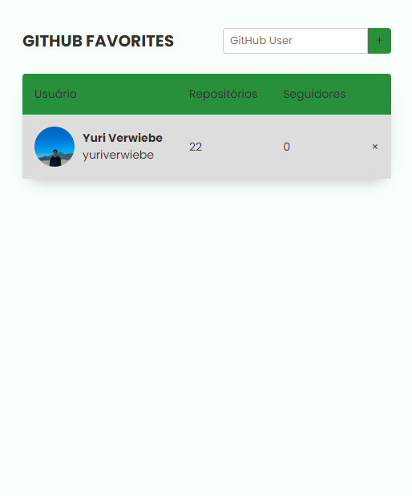

<h1 align="center"> Projeto Github Favorites </h1>

Projeto criado no curso Explorer da RocketSeat.

  <a href="#-tecnologias">Tecnologias</a>&nbsp;&nbsp;&nbsp;|&nbsp;&nbsp;&nbsp;
  <a href="#-projeto">Projeto</a>&nbsp;&nbsp;&nbsp;|&nbsp;&nbsp;&nbsp;
  <a href="#-licença">Licença</a>

  

 

  

## 🚀 Tecnologias

Esse projeto foi desenvolvido com as seguintes tecnologias:

- JavaScript
- HTML
- CSS
- Git e Github
- Figma

## 💻 Projeto

O projeto consiste em um site onde tem integração com uma API do Github que te permite colocar um user do Github e ela vai dar se o usuário existe se existir vai adicionar nos favoritos se não existir vai lançar um erro. Você pode manipular os usuários adicionados removendo os existentes ou adicionando novos.
 
 

## 📝 Licença

Esse projeto está sob a licença MIT.

---

Feito com ♥ by Yuri Verwiebe 🌊
